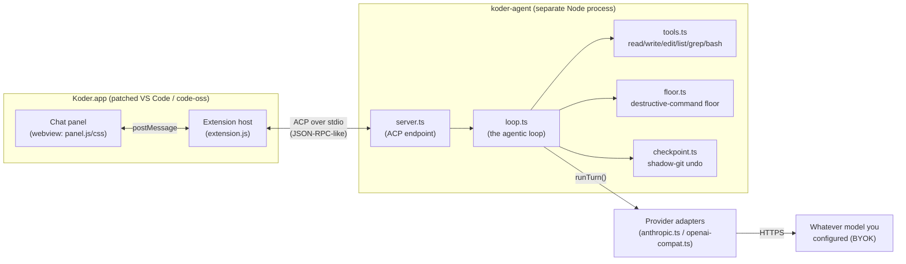
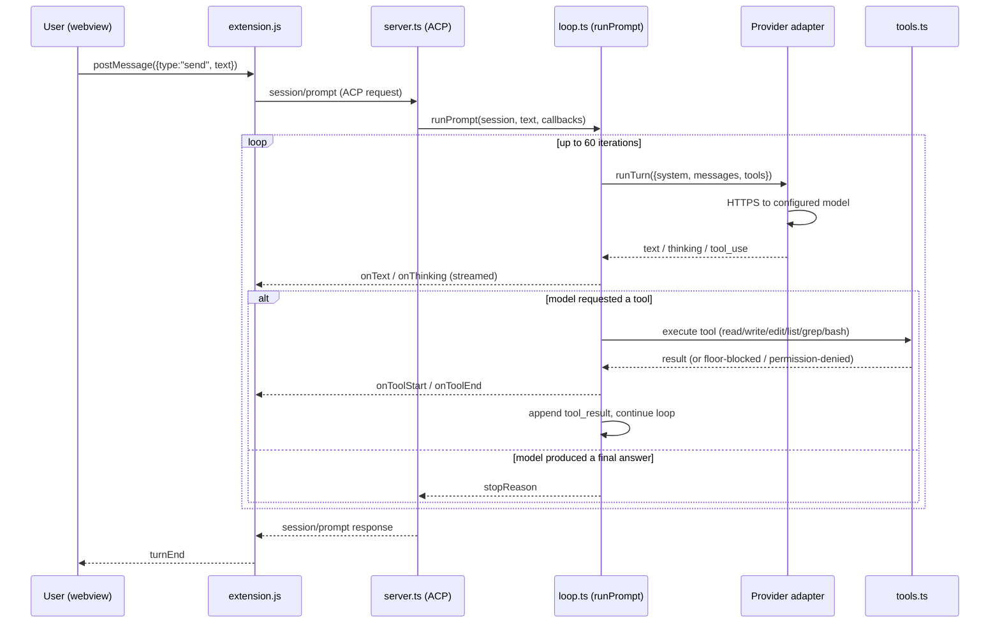
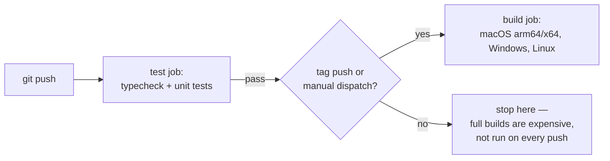

# Koder Architecture

This document explains how Koder is actually built: what's inherited, what's custom, how the
agent thinks and acts, and how the pieces talk to each other. It's written for someone who
knows the codebase exists but hasn't traced the wiring yet.

## 1. The one-sentence version

**Koder is two separate systems wired together**: a patched copy of Microsoft's VS Code
(the editor, file explorer, git integration, extension host — none of it custom), and a
small, hand-written agent runtime (no LangChain/AutoGPT/CrewAI — just a system-prompt-and-tool-calling
loop written directly against provider APIs) that the editor's chat panel talks to over a
standard protocol. Nothing here is a novel "agentic framework" — it's a lean implementation
of the same "system prompt + tool-calling loop" shape used by Claude Code, Cline, and
Cursor's agent mode, with hard-coded (not prompted) safety mechanisms wrapped around it.



---

## 2. The editor half: a fork, not a rewrite

`upstream/` is literally Microsoft's VS Code OSS source — `upstream/package.json`'s name
field is `code-oss-dev`. Koder does not implement a text editor, a file tree, a terminal, a
git integration, or an extension host. All of that is inherited wholesale from upstream.

What Koder actually does is **patch and reskin** upstream at build time:

| Piece | What it does |
|---|---|
| `scripts/apply-ui.mjs` | Copies custom extensions/themes (`product/koder-chat`, `product/koder-ui`, `product/theme-koder-carbon`, `product/theme-koder-symbols`) into `upstream/extensions/`, and patches specific upstream files in place (e.g. removing Copilot from the default install list, patching `dirs.ts`). Idempotent — safe to re-run. |
| `product/product.overrides.json` | JSON overrides merged into `upstream/product.json` at build time: branding, icons, `win32ContextMenu` CLSIDs, the (currently unset) integrity-checksum field. |
| `scripts/dev.sh` | Fast local dev loop: `npm run compile-client` then launches Electron directly against `upstream/` (no packaging step) — the way to test changes quickly instead of syncing into a packaged `.app`. |
| `.github/workflows/build.yml` | CI matrix: macOS arm64/x64, Windows, Linux. A fast `test` job (typecheck + unit tests) gates the expensive `build` job. Full 4-platform builds only run on release tags or manual dispatch, not every push. |

Because it's a straight fork, Koder gets VS Code's entire extension ecosystem, settings
system, keybinding system, and multi-platform packaging for free. The cost is that upstream
updates have to be re-applied through this same patch pipeline rather than merged normally.

### The custom extensions

- **`product/koder-chat`** — the agent chat panel. This is the interesting one; see §4-§6.
- **`product/koder-ui`** — the "Koder Dark" color theme (`themes/koder-dark-color-theme.json`)
  plus modern-default settings, registered as the actual default via `configurationDefaults`
  in its own `package.json` (`"workbench.colorTheme": "Koder Dark"`).
- **`product/theme-koder-carbon`**, **`product/theme-koder-symbols`** — icon themes.

---

## 3. The agent half: a separate OS process, not an in-editor feature

The "Koder Agent" you talk to in the chat panel is not part of the editor's own process at
all. It's `agent/src/server.ts`, compiled/bundled by esbuild into a single CommonJS file —
`agent/package.json`'s `bundle` script:

```
esbuild src/server.ts --bundle --platform=node --target=node20 --format=cjs \
  --outfile=../product/koder-chat/agent/server.cjs
```

`extension.js` spawns that bundle as a **child process** and talks to it over
**ACP (Agent Client Protocol)** — a JSON-RPC-style protocol over stdio (`@agentclientprotocol/sdk`).
ACP is a real, open, editor-agnostic protocol; other ACP clients (Zed, JetBrains) could in
principle drive this exact same agent binary. The dependency list for the whole agent is
short and telling:

```json
"dependencies": {
  "@agentclientprotocol/sdk": "^1.2.1",
  "@zed-industries/claude-code-acp": "^0.16.2"
}
```

No agent framework. The entire "intelligence" is: a system prompt, a conversation history
array, six tool definitions, and a loop.

### Why a separate process matters

- It can be killed and restarted independently of the editor UI (`session/cancel` →
  `AbortController`, hardened with `execWithKillEscalation()` in `tools.ts` — SIGTERM then
  SIGKILL escalation on the whole process group, so a stuck child can't ignore the signal).
- It's the same binary a phone can drive remotely (§8) — the extension host is just one ACP
  client among potentially several.
- It's independently testable (`agent/test/*.test.ts`, 79+ tests) without spinning up Electron.

---

## 4. The agentic loop, in detail

`agent/src/loop.ts`'s `runPrompt()` is the whole "brain." There is no planner, no graph, no
retrieval step baked into the framework — it's a `for` loop bounded by `MAX_ITERATIONS = 60`:



### Building the system prompt

`systemPrompt(cwd, mode)` (loop.ts) concatenates, in order:

1. **IDENTITY** — who the agent is.
2. **PRINCIPLES** — general behavior rules.
3. **TOOL_GUIDANCE** — how to use the six tools well.
4. **`modeBlock(mode)`** — mode-specific framing (see §5) — this is where "Review mode may
   only plan" or "Royal mode has no floor" actually gets stated to the model.
5. **ANTI_INJECTION** — guardrail text against prompt injection from tool output.

On top of that, `context.ts`'s `envBlock()` adds live repo context every turn: platform,
current date, workspace file listing, git branch and dirty state — and `loadRules()` pulls
in `.koder/rules.md` / `AGENTS.md` / `CLAUDE.md` if present, so user-authored project rules
ride along automatically.

### The six tools

`tools.ts` defines exactly six tool schemas, executed directly in Node — no sandboxing
framework, no filesystem virtualization:

| Tool | What it does |
|---|---|
| `read_file` | 1-based line-numbered read, with offset/limit |
| `write_file` | create/overwrite, makes parent dirs |
| `edit_file` | exact-string replace, refuses on 0 or >1 matches (forces precise edits) |
| `list_dir` | directory listing, trailing slash for dirs |
| `grep` | `path:line:text` matches |
| `bash` | shell execution, subject to the floor (§6) and mode-based permission gating |

### Provider abstraction (this is what makes BYOK work)

Both `providers/anthropic.ts` and `providers/openai-compat.ts` implement one shared
interface (`providers/types.ts`):

```ts
interface ChatAdapter { runTurn(req: TurnRequest): Promise<TurnResult>; }
```

`loop.ts` only ever talks to this interface — it has no idea whether it's talking to
Anthropic natively or an OpenAI-compatible endpoint. `config.ts`'s `PRESETS` map is what
makes "any OpenAI-compatible provider" concrete:

```
anthropic  → api.anthropic.com                (native Anthropic messages API)
openai     → api.openai.com/v1                (OpenAI-compatible)
openrouter → openrouter.ai/api/v1             (OpenAI-compatible)
deepseek   → api.deepseek.com/v1              (OpenAI-compatible)
groq       → api.groq.com/openai/v1           (OpenAI-compatible)
xai        → api.x.ai/v1                      (OpenAI-compatible)
gemini     → generativelanguage.googleapis.com/v1beta/openai  (OpenAI-compatible shim)
ollama     → localhost:11434/v1               (OpenAI-compatible, local, opt-in)
```

API keys live in `~/.koder/providers.json` in plaintext today (a code comment marks
`SecretStorage` — OS keychain-backed storage — as future Phase 2 work, not yet built).

The SSE stream reader (`providers/types.ts`'s `sseLines()`) has an **idle timeout**
(`KODER_STREAM_IDLE_MS`, default 45s) — a `Promise.race()` between the next chunk and a
resettable timer. This is deliberately an idle timeout, not a total-request timeout: it
catches a connection that's gone silent-but-still-open (dead proxy/VPN/overloaded free-tier
upstream) without killing a legitimately long generation.

---

## 5. Modes: the same loop, different guardrails

`AgentMode = "review" | "approve" | "auto" | "royal"` (loop.ts). Modes don't change the tool
set or the model — they change what's *allowed to happen without a human in the loop*, at
two levels: the system prompt text (`modeBlock`) and actual code-level gating in the tool
execution branch (loop.ts ~lines 234-342).

| Mode | Floor enforced? | Permission prompts? | Checkpoints? | Framing |
|---|---|---|---|---|
| **Review** | n/a (read-only) | n/a | n/a | Research and produce a plan only; `edit_file`/`write_file`/dangerous `bash` are disabled outright |
| **Approve** | Yes | Yes, every dangerous tool call | Yes | Nothing dangerous runs without an explicit Allow/Deny round-trip to the UI |
| **Auto** | Yes | No | Yes | Pre-approved, but the destructive-command floor still hard-blocks catastrophic commands |
| **Royal** | **No** | **No** | Yes (passive, different code path — see below) | Full autonomy, full machine access; the floor and permission system are skipped entirely |

**Auto is the locked/safe mode; Royal is the deliberately dangerous one** — bypassable by
design, not by omission. This was an explicit design decision: Royal mode trades away the
destructive-command floor and permission prompts for full unattended autonomy, but keeps a
*passive* safety net (checkpoint, audit log, kill switch) that never blocks or asks anything
in real time — it only records, so a human can review or undo after the fact.

### The destructive-command floor (`floor.ts`)

This is **not prompt engineering** — the model cannot talk its way past it. `floorCheck(name, input, cwd)`
is a pure, synchronous, deterministic classifier that runs in code before a tool executes in
review/approve/auto modes, blocking: force-push, history rewrites (`reset --hard`,
`filter-branch`), `rm -rf` outside the workspace, package publishes, disk-destroying commands
(`mkfs`, raw `dd`), piped-remote-script execution (`curl | sh`), and `sudo`/wrapper-prefix
bypass attempts. Royal mode explicitly skips this check — that's the entire point of the mode.

Royal mode does still guard one thing even against itself: `royalTamperCheck()` blocks any
tool call (even in Royal mode) from writing to or deleting its own audit/checkpoint storage
(`~/.koder/royal-audit/`, `~/.koder/checkpoints/`) — "a log you can erase isn't a log."

### The passive safety net: audit + checkpoints + kill switch

- **Audit log** (`audit.ts`) — `logRoyalAudit()` appends an entry (tool name, summarized
  input/output, timestamp) to an append-only log outside the workspace, specifically so
  Royal-mode actions remain accountable even though nothing was confirmed in real time.
- **Checkpoints** (`checkpoint.ts`) — a **shadow git repository**, separate from the user's
  own `.git`, that commits a snapshot of the workspace before/after every mutating tool call.
  Two commit kinds: a baseline commit once per prompt (`checkpointBaseline`) and a tool
  commit per mutating call (`commitAfterTool`), enabling both whole-prompt undo and
  per-file undo (`undoFile`/`undoPaths`) without touching the user's real git history at all.
  Royal mode currently checkpoints via a separate, simpler `checkpointBeforeMutation()` call
  for its own audit trail — this is being unified with the richer UI-facing path so Royal-mode
  edits show the same "Files changed" undo affordance the other modes get (in progress).
- **Kill switch** — `session/cancel` (ACP notification) → `AbortController.abort()` →
  for `bash` specifically, `execWithKillEscalation()` sends SIGTERM to the whole process
  group (negative PID), waits `KILL_GRACE_MS` (2s), then escalates to SIGKILL — so a child
  process that ignores SIGTERM can't keep the agent from actually stopping.

---

## 6. Undo, concretely: two UI surfaces, one backend

Doc `docs/research/11-prompt-checkpoints-undo.md` designed this; here's the shipped shape:

- **Chat panel** — a "Files changed (N)" card renders inline per prompt (`panel.js`'s
  `applyCheckpoint`/`renderCheckpointCard`), fed live by `koder/checkpoint` notifications as
  each mutating tool call commits. Has both a per-file "Undo" button and one "Undo all N
  files" button. Conflict handling (`koder/undo_file`/`koder/undo_prompt`) checks disk
  against the target SHA *first* — if it already matches, it's a no-op, not a conflict
  (catches a subtle bug: naively diffing only against HEAD would false-positive a "manual
  edit" on a second undo of the same prompt, since a completed undo legitimately leaves disk
  at an older SHA while HEAD still points at the last tool commit).
- **Editor title bar** — a `koder.undoFileChanges` command, shown only when
  `koder.fileHasCheckpoint` (a `when`-clause context key, recomputed on every active-editor
  change) is true for the currently open file — a single-click "undo what the agent last did
  to this file," independent of the chat panel being open at all.

Both surfaces call into the same `checkpoint.ts` functions — there's exactly one source of
truth for "what changed and what can be undone."

---

## 7. Chat panel internals: webview ↔ extension host

The chat panel is a VS Code **webview** (`panel.js`/`panel.css`, sandboxed HTML/JS/CSS with
no direct filesystem or Node access) hosted by `extension.js`'s `AgentViewProvider`. The two
sides only ever talk via `postMessage` — a small, ad-hoc message-type protocol, not a formal
schema:

- Webview → extension: `{type: "send", text, attachments}`, `{type:"setMode", mode}`,
  `{type:"undoFile"/"undoPrompt", ...}`, `{type:"attachActiveFile"}`, `{type:"feedback", ...}`, etc.
- Extension → webview: `{type:"chunk"/"thought", text}` (streamed model output),
  `{type:"tool"/"toolUpdate"}`, `{type:"checkpoint"}`, `{type:"permission"}`,
  `{type:"replay", events}` (full transcript replay when the webview is recreated — VS Code
  disposes and recreates webviews when hidden, so nothing here assumes the DOM survives).

File attachment (drag-drop, `@`-mention, "attach current file") is chip-based UI state in the
webview; the actual file read and prompt-block expansion happens extension-side (the webview
has no fs access), and is appended only to the *outgoing* prompt sent to the model — never
into the displayed or persisted chat transcript, so re-opening a chat doesn't show raw file
dumps.

---

## 8. Remote control: your phone as a second ACP-adjacent client

`product/koder-chat/remote-server.js` runs a LAN-local HTTP+SSE server (off by default),
paired via a QR code (`remote-qr.js`) carrying a session-lifetime random token. Once paired,
`remote-page.js` (a small mobile web page) can:

- **View** the live desktop conversation (SSE mirror of the same events the desktop panel gets).
- **Send** prompts (`POST /control/send`), **approve/deny** permission prompts
  (`POST /control/permission`), and **switch modes** (`POST /control/setMode`) —
  all routed through the exact same `AgentViewProvider` methods the desktop UI calls, not a
  parallel code path.

Security posture: off by default, Host-header validated on every request (mitigates DNS
rebinding / "0.0.0.0-day" attacks), no persistence beyond the in-memory session token, and a
busy-guard (`409`) prevents a phone and the desktop from racing into two simultaneous prompts.

---

## 9. Build & CI, briefly



Local iteration doesn't go through packaging at all: `scripts/dev.sh` runs
`compile-client` then launches Electron straight from `upstream/` for fast reload. Testing
against an already-*installed* `.app` requires manually re-syncing changed files into
`Contents/Resources/app/extensions/<ext>/` and re-signing (`codesign --force --deep -s -`) —
copying files into an already-signed bundle invalidates its signature, which is what causes
a Keychain re-prompt on next launch if you skip the re-sign step.

---

## 10. What to read next

- `docs/research/09-royal-mode-autonomous.md` — Royal mode's full design rationale.
- `docs/research/10-remote-control.md` — remote control's phased design (view-only → full control).
- `docs/research/11-prompt-checkpoints-undo.md` — the undo feature's complete design doc,
  including nested-git-repo edge cases, retention/compaction, and UI sketches for both surfaces.
- `agent/test/*.test.ts` — the test suite is, in practice, the most precise spec of current
  behavior for the floor, checkpoints, and mode differences.
